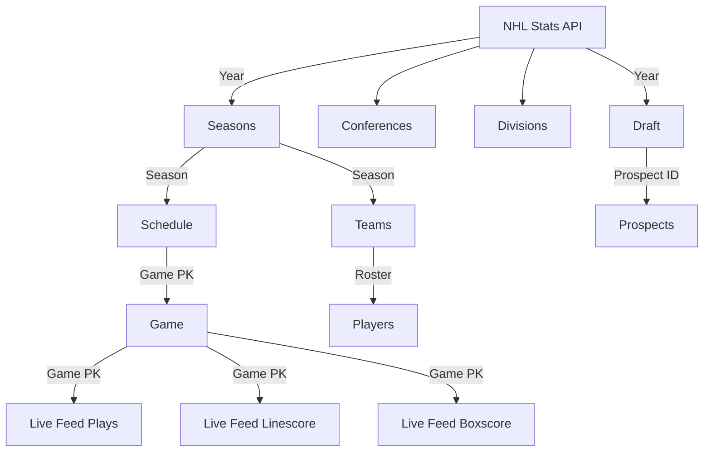

# tap-nhl

`tap-nhl` is a Singer tap for the NHL Stats API.

Built with the [Meltano Tap SDK](https://sdk.meltano.com) for Singer Taps.


## Flow diagram


## Installation

```bash
pipx install git+https://github.com/gavh3/tap-nhl.git
```

## Configuration

### Accepted Config Options

A full list of supported settings and capabilities for this
tap is available by running:

```bash
tap-nhl --about
```

## Usage

You can easily run `tap-nhl` by itself or in a pipeline using [Meltano](https://meltano.com/).

### Executing the Tap Directly

```bash
tap-nhl --version
tap-nhl --help
tap-nhl --config CONFIG --discover > ./catalog.json
```

### Initialize your Development Environment

```bash
pipx install poetry
poetry install
```

### Create and Run Tests

Create tests within the `tap_nhl/tests` subfolder and
  then run:

```bash
poetry run pytest
```

You can also test the `tap-nhl` CLI interface directly using `poetry run`:

```bash
poetry run tap-nhl --help
```

### Testing with [Meltano](https://www.meltano.com)

_**Note:** This tap will work in any Singer environment and does not require Meltano.
Examples here are for convenience and to streamline end-to-end orchestration scenarios._

Next, install Meltano (if you haven't already) and any needed plugins:

```bash
# Install meltano
pipx install meltano
# Initialize meltano within this directory
cd tap-nhl
meltano install
```

Now you can test and orchestrate using Meltano:

```bash
# Test invocation:
meltano invoke tap-nhl --version
# OR run a test `elt` pipeline:
meltano elt tap-nhl target-jsonl
```

### SDK Dev Guide

See the [dev guide](https://sdk.meltano.com/en/latest/dev_guide.html) for more instructions on how to use the SDK to
develop your own taps and targets.
